# Chat-bot-digram
# Chatbot Architecture Diagrams - e2-student-portal

> Visual diagrams explaining how the chatbot system works end-to-end.
> Render these with any Mermaid-compatible viewer (GitHub, VS Code extension, Mermaid Live Editor).

---

## 1. High-Level System Architecture

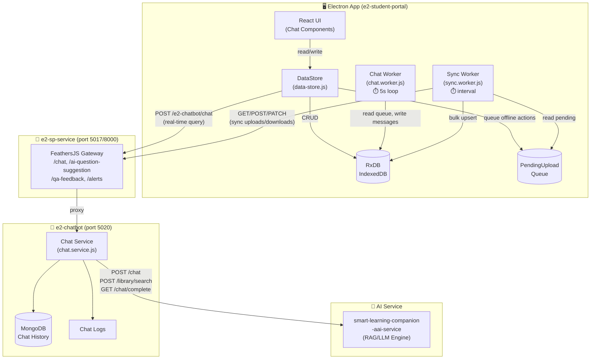

---

## 2. Component Hierarchy

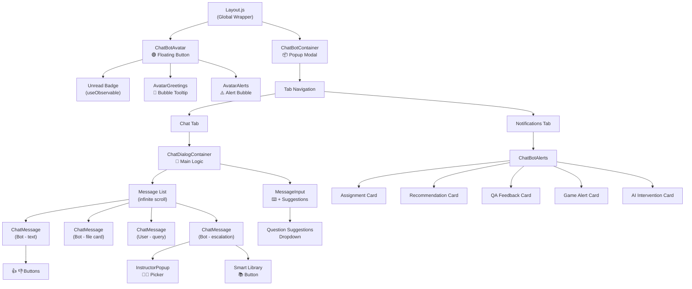

---

## 3. Message Send Flow (Online)

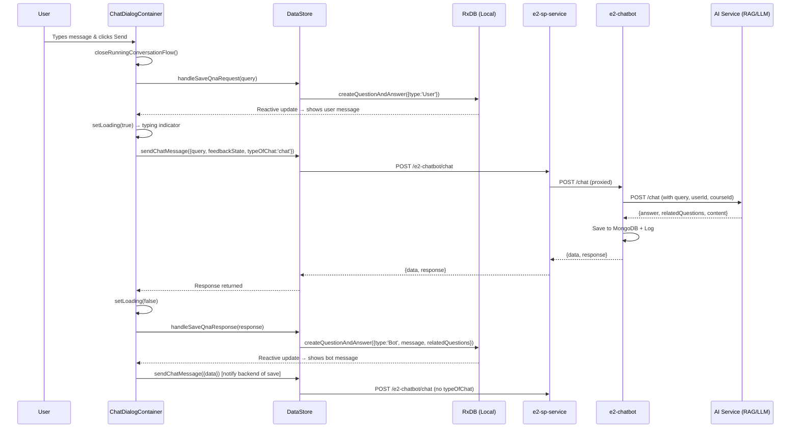

---

## 4. Like / Dislike Escalation Flow

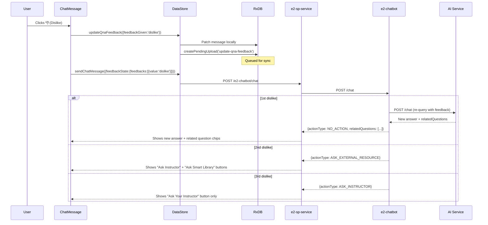

---

## 5. Offline Sync Architecture

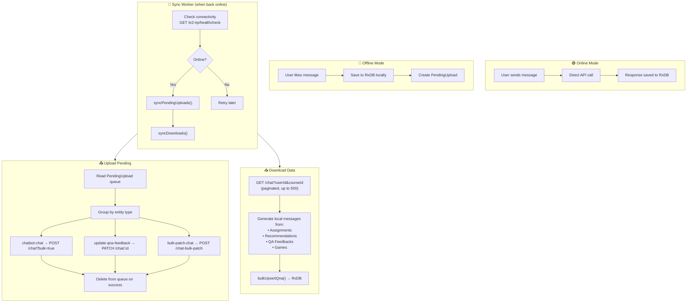

---

## 6. Proactive Conversation System (Chat Worker)

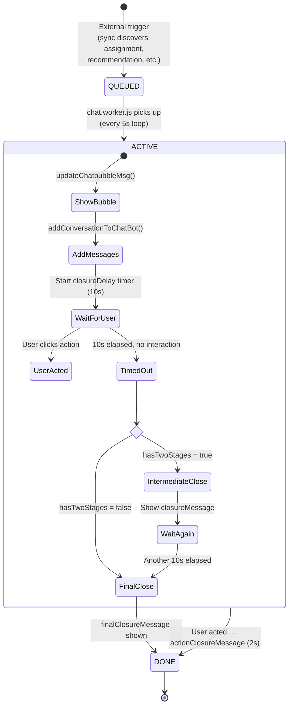

---

## 7. Data Model Relationships

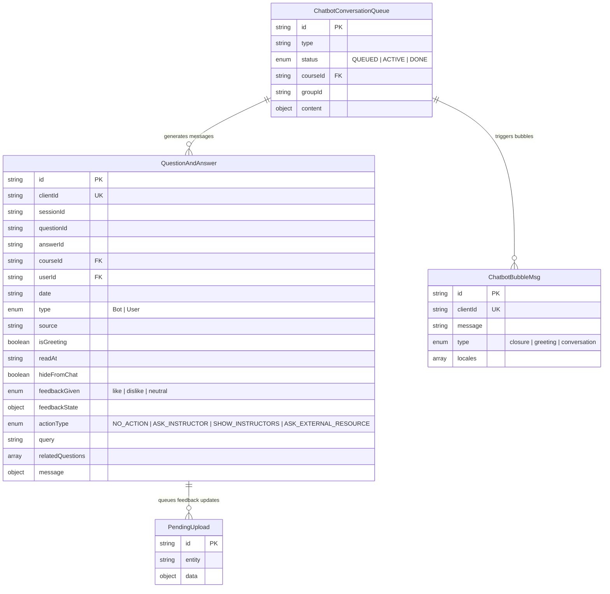

---

## 8. Service Communication Map

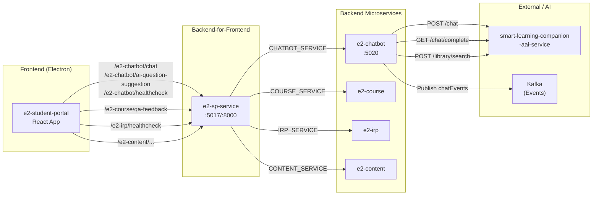

---

## 9. User Journey: Complete Chat Session

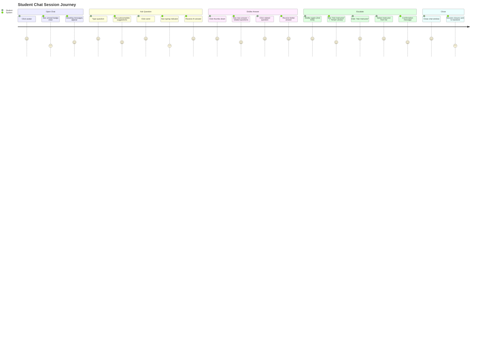

---

## 10. Feature Toggle & Visibility Logic

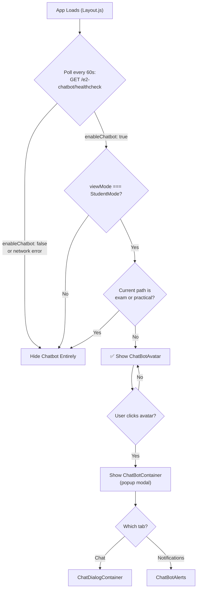

---

## 11. API Request Flow (with Proxy)

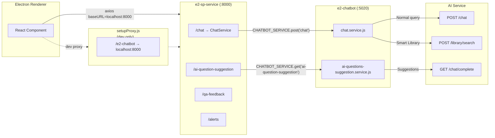

---

## Quick Reference: Port Map

| Service | Port | Role |
|---|---|---|
| e2-student-portal (React) | 3000 | Frontend UI |
| e2-sp-service | 5017 (internal), 8000 (exposed) | BFF Gateway |
| e2-chatbot | 5020 | Chatbot orchestrator |
| smart-learning-companion-aai-service | remote | AI/RAG engine |
| MongoDB | 27017 | Chat persistence |
| e2-course | varies | Course data |
| e2-irp | 5000 | Health/connectivity check |

---

## How to Read These Diagrams

- **Diagram 1** — Shows the overall system architecture and data flow between all layers
- **Diagram 2** — Shows how React components are nested and composed
- **Diagram 3** — Step-by-step message sending sequence
- **Diagram 4** — How the dislike escalation works over time
- **Diagram 5** — How offline sync uploads/downloads work
- **Diagram 6** — State machine for proactive conversation lifecycle
- **Diagram 7** — Database entity relationships
- **Diagram 8** — Service-to-service communication topology
- **Diagram 9** — User experience journey through a chat session
- **Diagram 10** — Decision tree for showing/hiding the chatbot
- **Diagram 11** — How HTTP requests flow through proxies to backend services
