# Chatbot Implementation Diagrams - e2-student-app-web

> Visual diagrams for implementing the chatbot in the new web application.
> Render these with any Mermaid-compatible viewer (GitHub, VS Code extension, Mermaid Live Editor).

---

## 1. High-Level Architecture (Online-Only)

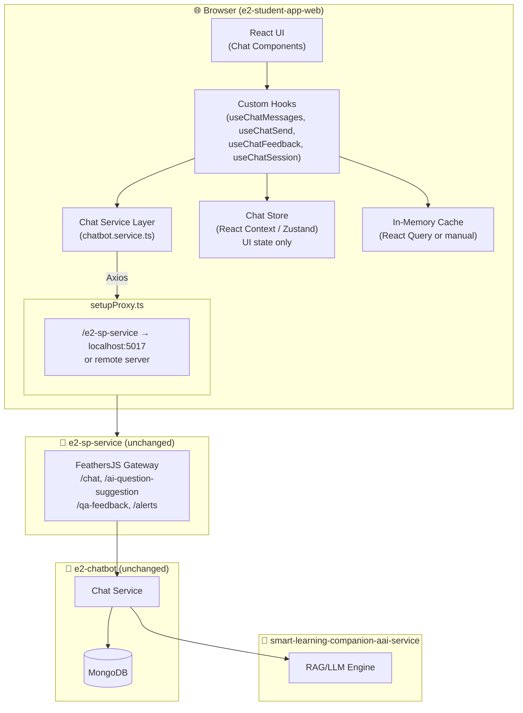

---

## 2. Comparison: Legacy vs New Architecture

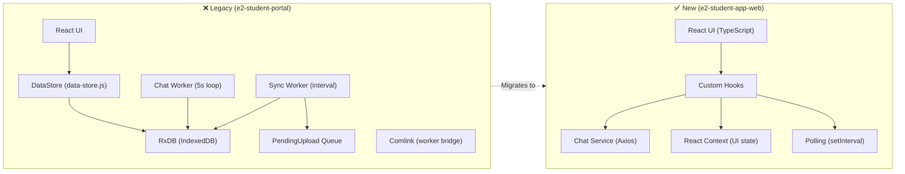

---

## 3. Component Architecture

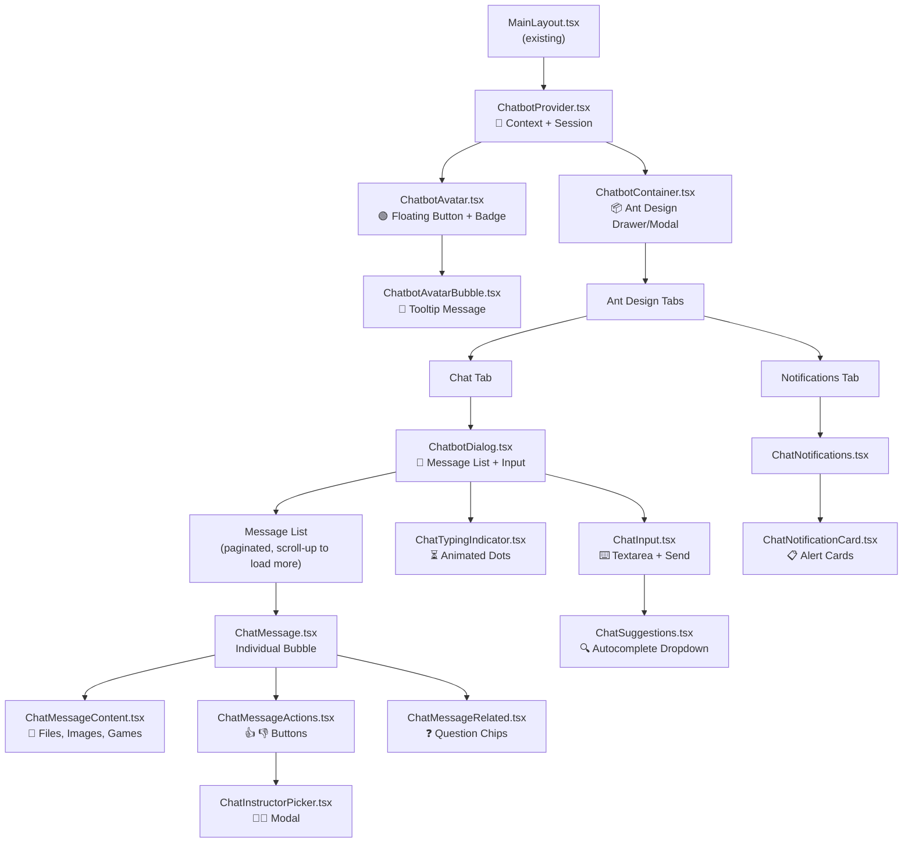

---

## 4. Data Flow: Send Message (Online-Only)

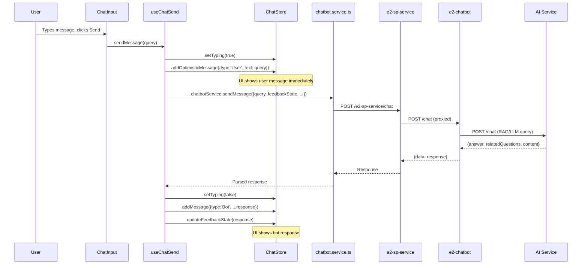

---

## 5. Data Flow: Like / Dislike with Escalation

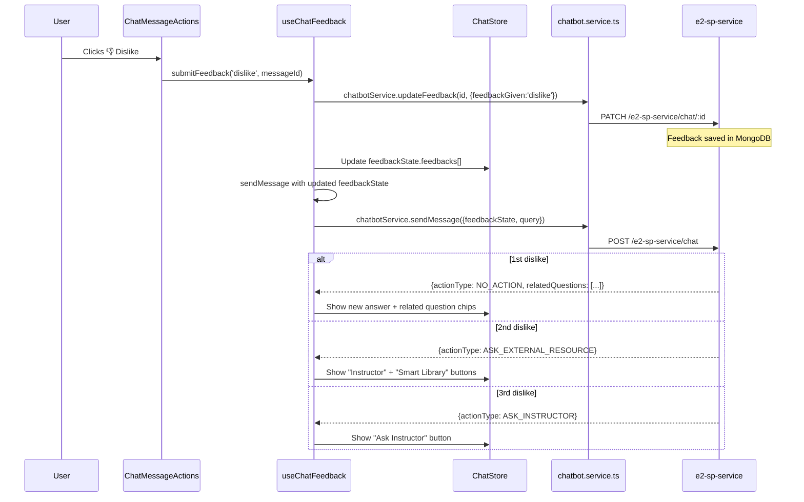

---

## 6. State Management Design

```mermaid
graph TB
    subgraph ServerState["📡 Server State (fetched from API)"]
        direction TB
        S1["Chat Messages<br/>(paginated history)"]
        S2["Unread Count"]
        S3["Suggestions<br/>(autocomplete)"]
        S4["Notifications<br/>(alerts)"]
        S5["Healthcheck<br/>(chatbot enabled?)"]
    end

    subgraph ClientState["💾 Client UI State (React Context)"]
        direction TB
        C1["isOpen: boolean"]
        C2["activeTab: 'chat' | 'notifications'"]
        C3["isTyping: boolean"]
        C4["sessionId: string"]
        C5["feedbackState: FeedbackState"]
        C6["error: string | null"]
    end

    subgraph Hooks["🪝 Custom Hooks (bridge)"]
        direction TB
        H1["useChatMessages()"]
        H2["useChatSend()"]
        H3["useChatFeedback()"]
        H4["useChatSuggestions()"]
        H5["useChatSession()"]
        H6["useChatHealthcheck()"]
        H7["useChatUnreadCount()"]
        H8["useChatNotifications()"]
    end

    H1 --> S1
    H2 --> S1
    H2 --> C3
    H2 --> C5
    H3 --> S1
    H3 --> C5
    H4 --> S3
    H5 --> C4
    H6 --> S5
    H7 --> S2
    H8 --> S4
```

---

## 7. API Routes Map

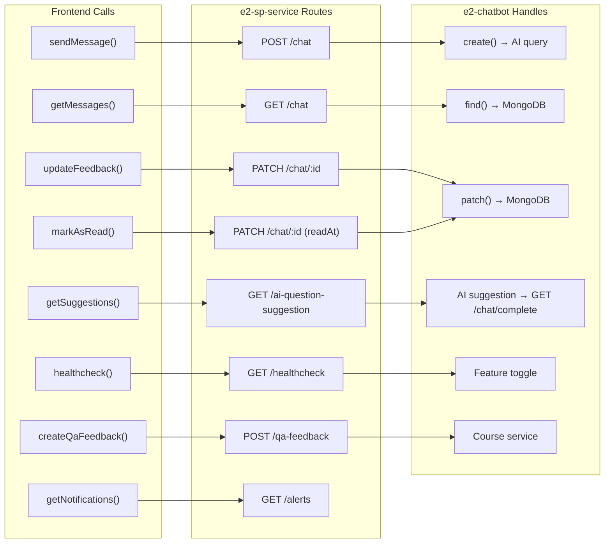

---

## 8. File Structure Implementation Map

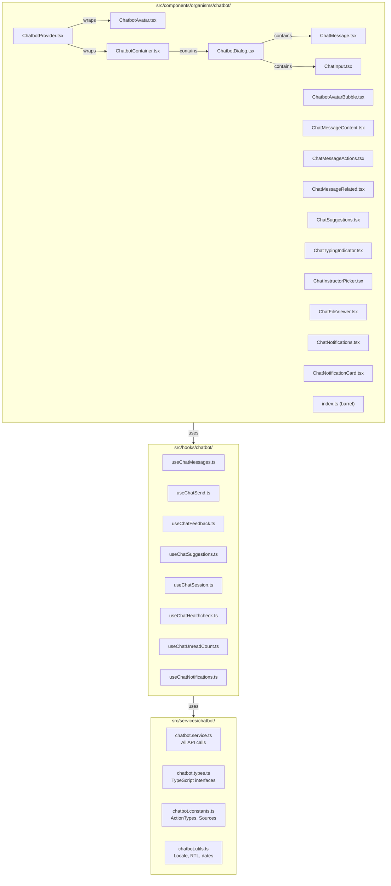

---

## 9. Implementation Phases (Timeline)

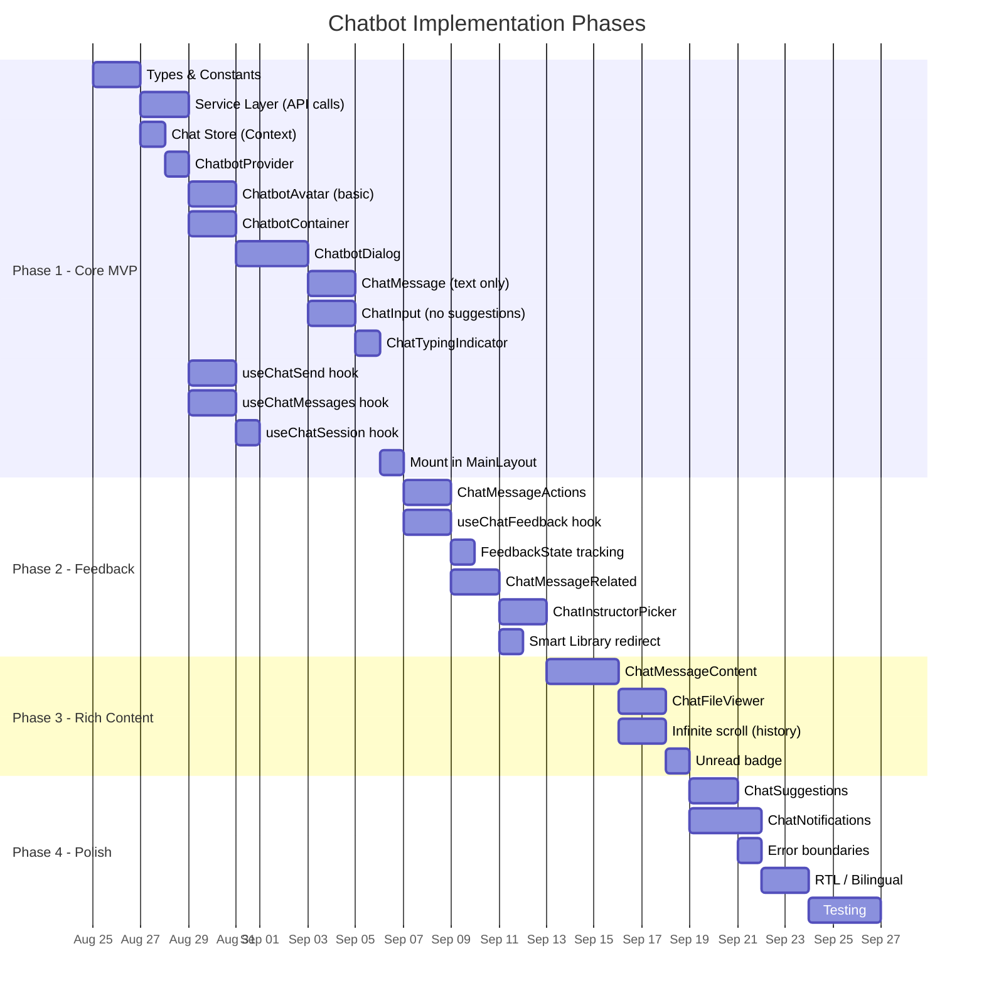

---

## 10. Session Lifecycle (Web vs Legacy)

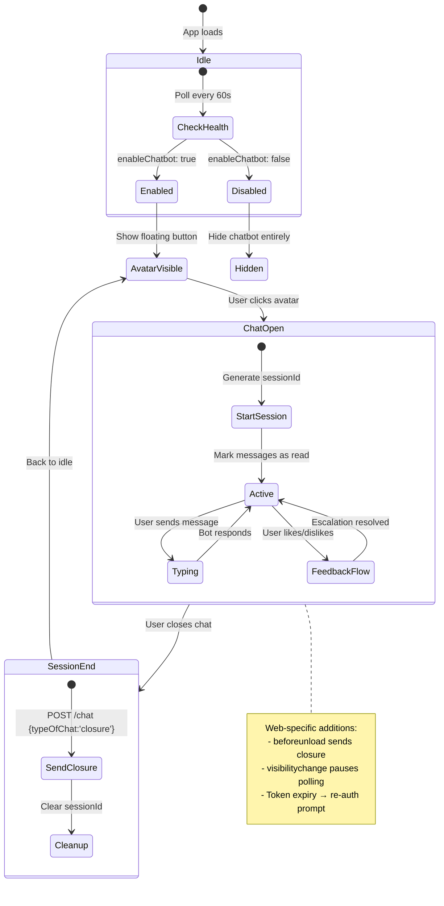

---

## 11. Error Handling Strategy

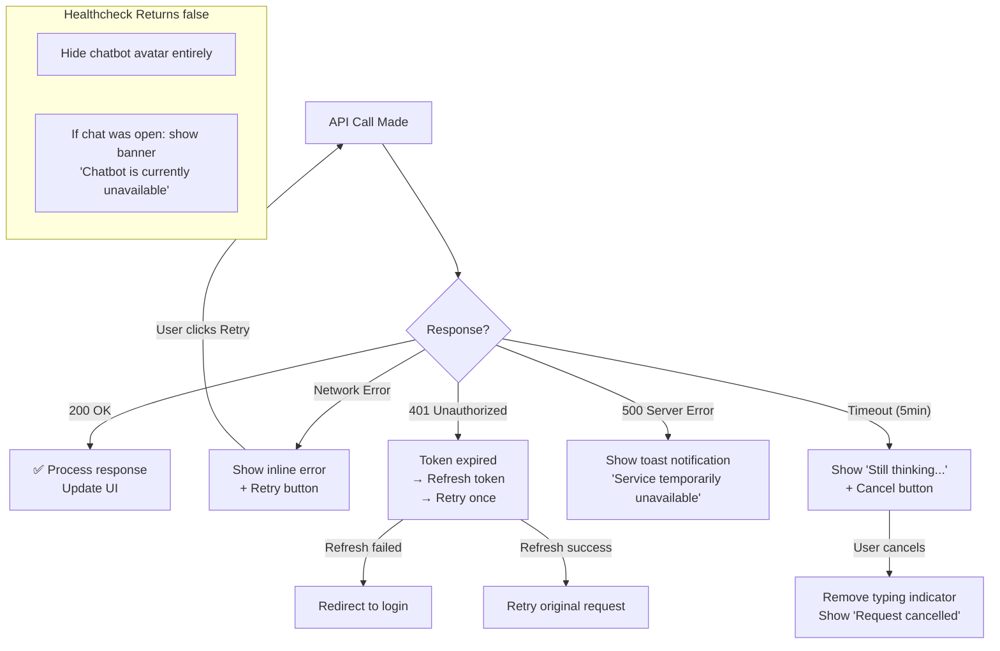

---

## 12. Polling Strategy (No WebSocket)

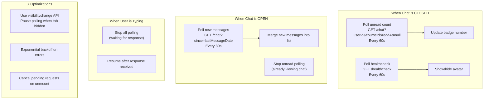

---

## 13. Migration Path: What Maps Where

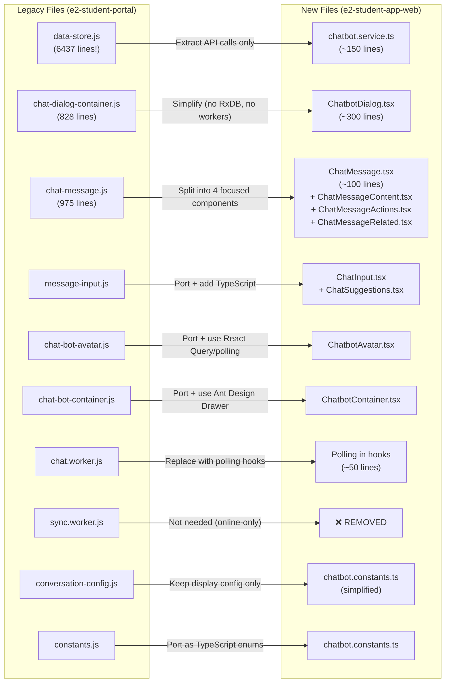

---

## 14. Suggested Ant Design Components Usage

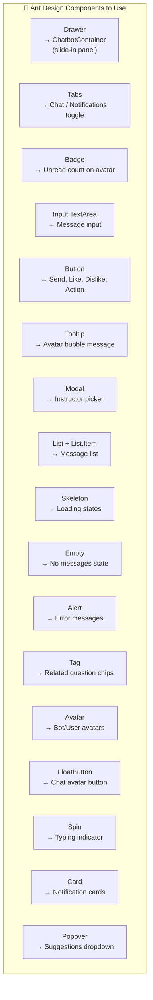

---

## 15. Feature Flag & Graceful Degradation

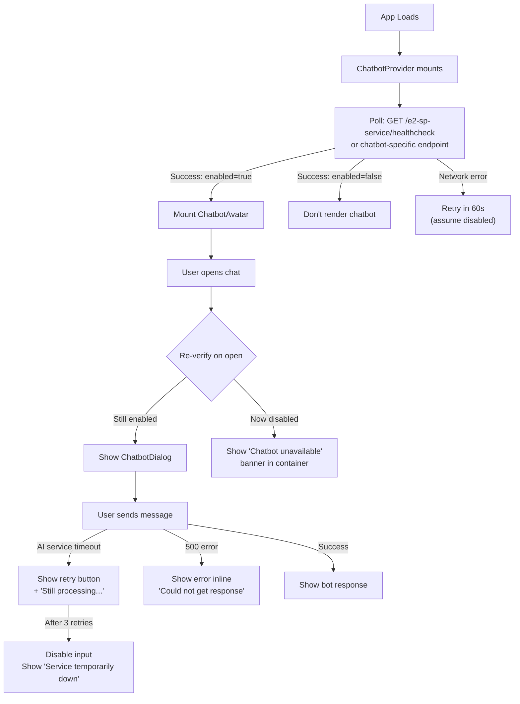

---

## Quick Reference: Technology Decisions

| Decision | Recommendation | Rationale |
|---|---|---|
| State management | React Context (existing pattern) | Consistent with app, chatbot state is simple |
| Data fetching | StoreContext Axios + custom hooks | No new deps, team knows it |
| Real-time updates | `setInterval` polling (30-60s) | Simple, no backend changes needed |
| UI library | Ant Design (already installed) | Drawer, Tabs, Badge, Modal all ready |
| List rendering | Simple pagination (20 per page) | Adequate for chat, no virtualization needed |
| File viewing | Existing `FileViewer` component | Already built at `src/components/molecules/file-viewer/` |
| Typing | TypeScript strict | Matches app standard |
| Testing | Vitest + React Testing Library | Already configured |
| Styling | SCSS modules (existing pattern) | Consistent with app |
| Icons | `@phosphor-icons/react` (installed) | Send, ThumbsUp, ThumbsDown, etc. |

---

## How to Read These Diagrams

| # | Diagram | What It Explains |
|---|---|---|
| 1 | System Architecture | Overall service topology for the web app |
| 2 | Legacy vs New | Side-by-side comparison of what changes |
| 3 | Component Tree | React component hierarchy to build |
| 4 | Send Message Flow | Step-by-step sequence for sending a message |
| 5 | Feedback Flow | Like/dislike escalation sequence |
| 6 | State Design | What lives where (server vs client) |
| 7 | API Routes | Complete endpoint mapping |
| 8 | File Structure | What files to create and their relationships |
| 9 | Timeline | Gantt chart of implementation phases |
| 10 | Session Lifecycle | State machine for chat open/close/error |
| 11 | Error Handling | Decision tree for all error scenarios |
| 12 | Polling Strategy | When and how to poll for updates |
| 13 | Migration Map | Which legacy file becomes which new file |
| 14 | Ant Design Usage | Which existing UI components to leverage |
| 15 | Feature Flag | Graceful degradation flowchart |
